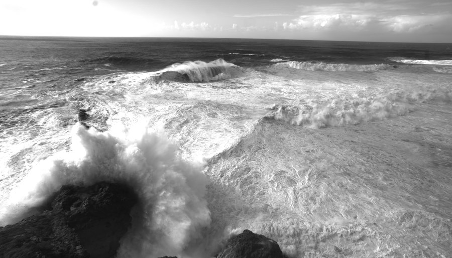
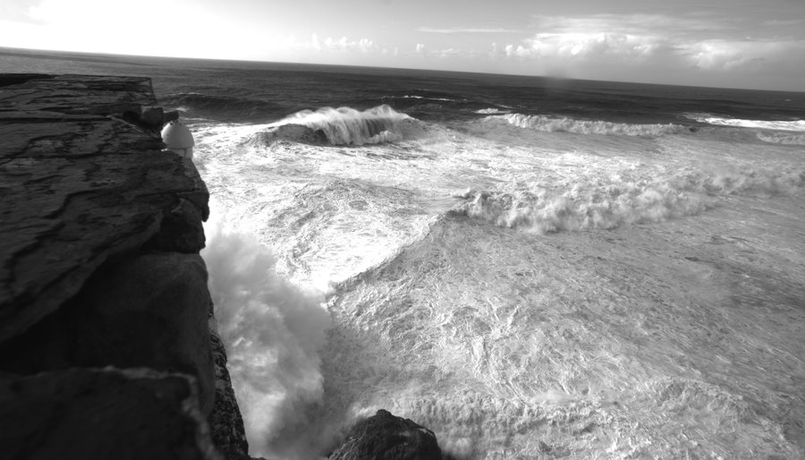
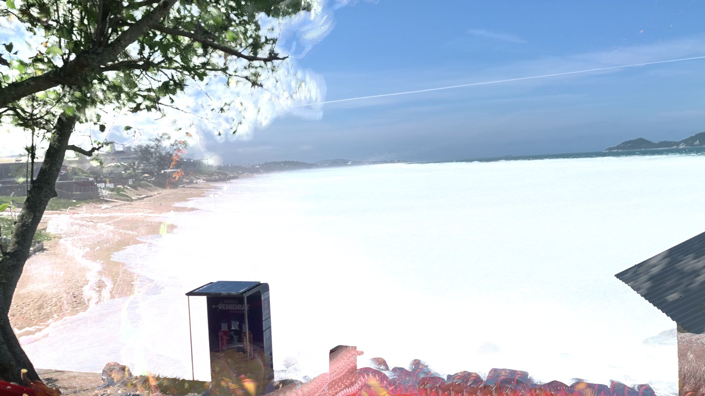
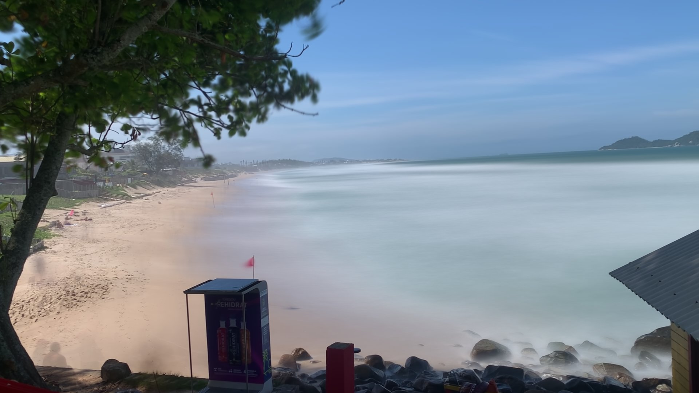
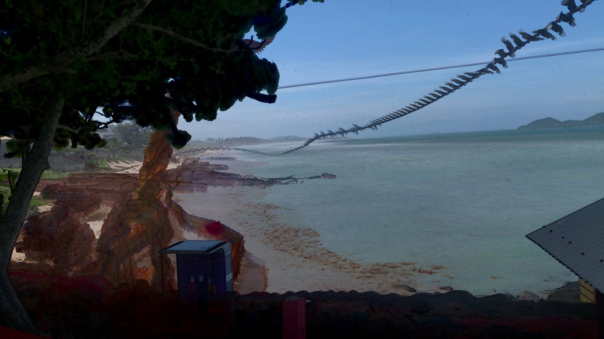
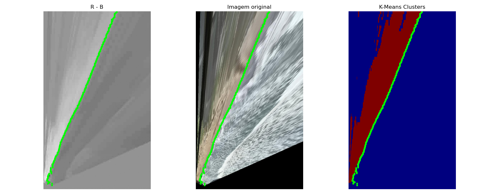

# Bruno Colling Acosta

. . · ´  ( `· _¸ . · ´  ( `· . .  . . · ´ ( `· _¸ . · ´ ( `· . .

Geophysicist | Physics graduate from PUCRS | Oceanography M.Sc. candidate @ UFSC

Physical Oceanography | Surf Science | Stereo-video systems | Coastal video imaging | Computer vision | 3D reconstruction

## MSc Research

**ESTIMATING THE OVERTURNING SHAPE OF EXTREME WAVES AT NAZARE, PORTUGAL, BASED ON STEREO VIDEO MEASUREMENTS**

  
  

  <em>Stereo-video frames used for 3D reconstruction of an extreme wave at Nazaré, Portugal.</em>

  

  <em>3D point cloud visualization of an overturning extreme wave at Nazaré, Portugal.</em>

---

## Other Projects

- Transforming ocean imagery into quantitative and physically interpretable information.

- Experimental applications of computer vision and deep learning techniques to stereo-video and coastal video imaging data.

  
  
  

  <em>Image products derived from coastal video imaging workflows.</em>

  

  <em>Experimental coastline detection using K-means clustering.</em>

---

## Visual Notes

  
  

  

---

This profile is intended to gradually document, share and make available to the scientific community several processing pipelines, visualization tools and computational experiments currently under development.

For now, you can watch the recording of my second M.Sc. qualification presentation related to the research development report at PPGOceano/UFSC:

In addition, the repository below contains references and materials used throughout the development of the research and related projects:

https://github.com/Bruno-Colling-Acosta/Mestrado-Referencias
